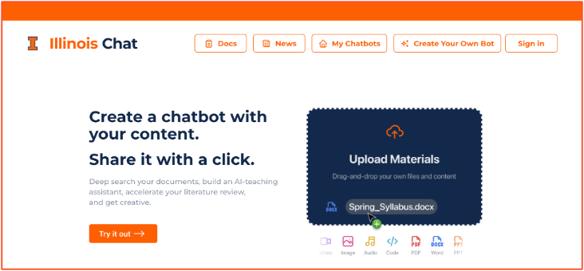

# Illinois Chat

Illinois Chat is a self-hostable AI chat platform for building course, research, and organization-specific chatbots over curated documents and web content. The campus-supported instance runs at [chat.illinois.edu](https://chat.illinois.edu); this repository is everything needed to run it yourself.



**Documentation: [docs.chat.illinois.edu](https://docs.chat.illinois.edu/)** — using and building chatbots, the API, self-hosting, and contributing. The site is built from `docs/` in this repository.

## What is in this repository

| Path | Contents |
| --- | --- |
| `apps/frontend` | Next.js web application |
| `apps/backend` | Flask backend and RabbitMQ ingest worker |
| `apps/crawlee` | Crawlee web-crawling service |
| `infra/docker` | Docker Compose files for the full stack, local development, Sim AI and Ollama |
| `infra/db` | Postgres schema and external-store migrations |
| `infra/keycloak` | Keycloak realm exports and login theme |
| `infra/scripts` | Start and stop scripts |
| `docs/` | This documentation site (MkDocs) |

The full tree is described on [Repository layout](https://docs.chat.illinois.edu/contributing/repository-layout/).

## Run the full stack

Requires Docker and Docker Compose.

```bash
git clone https://github.com/Center-for-AI-Innovation/Illinois-Chat.git
cd Illinois-Chat
cp .env.template .env
# set SIM_APPROVAL_ADMIN_EMAIL in .env (or start with --no-sim)
bash infra/scripts/start-all.sh --create-schema   # first run; later runs need no flag
```

The frontend is at `http://localhost:3000`. `bash infra/scripts/stop-all.sh` stops the stack and keeps the data. First-run details, flags, the services and ports, configuration, upgrades, backups and troubleshooting are under [Self-Hosting](https://docs.chat.illinois.edu/self-hosting/).

## Develop

To run the apps on your machine with hot reload while Docker provides the infrastructure, follow [Development setup](https://docs.chat.illinois.edu/contributing/dev-setup/): environment, package installation, `start-dev.sh`, then the three app processes. [Testing & CI](https://docs.chat.illinois.edu/contributing/testing-ci/) describes what pull requests run; [Writing docs](https://docs.chat.illinois.edu/contributing/writing-docs/) covers this documentation.

## License

Illinois Chat is licensed under the Apache License, Version 2.0. See `LICENSE`.
