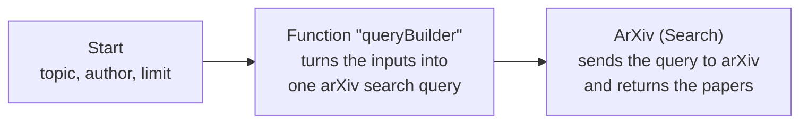

# Build a Tool in Sim: arXiv Example

This guide walks through building a tool in Sim AI, from an empty workflow to a chatbot that calls it. The example is a **research paper search** tool built on Sim's ArXiv block. It needs no API key, so you can follow along without signing up for anything.

The finished tool takes three inputs:

| Input    | What it does                                        |
| -------- | --------------------------------------------------- |
| `topic`  | Keywords or a subject, e.g. "diffusion models"      |
| `author` | An author name, e.g. "Yang Song" or just "Song"     |
| `limit`  | How many papers to return                           |

You can give it a topic, an author, or both. A topic alone finds papers on that subject. An author alone lists that author's papers. Both together finds that author's papers on the topic. Sim's ArXiv block cannot do that last case out of the box, and solving it shows a pattern you will reuse in most tools.

!!! info "Before you start"
    You need a Sim account and a Sim workspace connected to your Illinois Chat project. The [Sim AI user guide](sim-user-guide.md) covers signing in, admin approval, and connecting a workspace on your project's **Tools** page. For how tools work once connected, see [Tools & Workflows](index.md).

## Shortcut: import the finished tool

If you would rather start from a working copy and read along:

1. Download [arxiv-paper-search-workflow.json](../../assets/arxiv-paper-search-workflow.json).
2. In Sim, open the **⋯** menu next to **Workflows** in the sidebar and choose **Import workflow**.
3. Pick the downloaded file. The workflow opens with all three blocks wired up.
4. Skip to [Step 5: Test it in Sim](#step-5-test-it-in-sim).

## How the workflow fits together



* The **Start** block declares the tool's inputs. Illinois Chat reads them to tell the chatbot what arguments the tool takes.
* The **Function** block turns whatever inputs were provided into a single search query.
* The **ArXiv** block runs that query. Its output is the last thing the workflow produces, so it is what the chatbot receives.

## Step 1: Create the workflow

In your Sim workspace, create a new workflow. Give it a name that says what it does, such as **Research Paper Search tool**. The chatbot sees this name, so avoid names like "Test 3".

## Step 2: Declare the inputs on the Start block

Open the **Start** block and add three input fields:

| Name     | Type   | Value | Description                                                                                                                                                      |
| -------- | ------ | ----- | ---------------------------------------------------------------------------------------------------------------------------------------------------------------- |
| `topic`  | string |       | Subject or keywords to search for, e.g. "diffusion models" or "protein folding". Searched across title, abstract, and full text. Optional if author is given. |
| `author` | string |       | Author name to filter by, e.g. "Yang Song" or just "Song". Optional if topic is given.                                                                          |
| `limit`  | number | 10    | Optional. Maximum number of papers to return. Defaults to 10, maximum 2000.                                                                                      |

These descriptions do more work than they appear to. Three rules apply to every tool you build.

**Every input needs a description.** The chatbot reads the descriptions to decide what to put in each argument. Write them for someone who has never seen your workflow, and include an example value.

**An input is optional only if its description says so.** Sim does not have a "required" switch, so Illinois Chat reads the description text. An input counts as optional when its description contains a word or phrase like *optional*, *not required*, *can be left blank* or *can be omitted*. Everything else is treated as required, and the chatbot must always supply it.

!!! warning "The word *required* wins"
    The word **required** anywhere in a description makes that input required, even next to the word *optional*. A description like "Optional. At least one of topic or author is required." is read as **required**. Put rules that span several inputs in the workflow description instead ([Step 6](#step-6-deploy-and-describe-the-tool)).

**The Value column is the default.** When the chatbot leaves an optional input out, Sim fills it with the value you typed in the Start block. Here, a missing `limit` becomes 10. Leave `topic` and `author` empty so that "not provided" really means empty.

## Step 3: Build the query in a Function block

Add a **Function** block after the Start block, connect them, and name it `queryBuilder`. Set the language to JavaScript and paste this code:

```javascript
const topic = <start.topic>;
const author = <start.author>;
const limit = <start.limit>;

// Treat undefined, null and whitespace-only the same: "not provided".
const clean = (v) => (v == null ? '' : String(v).trim());
// arXiv uses double quotes for phrase search, so drop any the user typed.
const phrase = (v) => clean(v).replace(/"/g, '');

const clauses = [];

if (clean(topic)) {
  clauses.push(`all:"${phrase(topic)}"`);
}

if (clean(author)) {
  clauses.push(`au:"${phrase(author)}"`);
}

if (clauses.length === 0) {
  throw new Error('Provide a topic, an author, or both');
}

const parsed = Number.parseInt(clean(limit), 10);
const maxResults =
  Number.isFinite(parsed) && parsed > 0 ? Math.min(parsed, 2000) : 10;

return {
  query: clauses.join(' AND '),
  maxResults,
};
```

A few things to notice:

* **References go in without quotes.** In a Function block, Sim replaces `<start.topic>` with the actual value as JavaScript, so a text input arrives as a string. Writing `'<start.topic>'` would wrap it in a second set of quotes.
* **The query uses arXiv's own search syntax.** `all:` searches every field and `au:` searches authors. Clauses are joined with `AND`, so each input you add narrows the results.
* **Topics are wrapped in double quotes** so a multi-word topic is searched as a phrase. Without them, `machine learning` would match any paper containing both words anywhere.
* **The code refuses to run with nothing to search for.** If both inputs are empty, the run fails with a clear message, which the chatbot can pass on.

Here is what the block sends for each combination of inputs:

| topic            | author | Query sent to arXiv                        |
| ---------------- | ------ | ------------------------------------------ |
| diffusion models | Song   | `all:"diffusion models" AND au:"Song"`     |
| diffusion models |        | `all:"diffusion models"`                   |
|                  | Song   | `au:"Song"`                                |
|                  |        | Error: "Provide a topic, an author, or both" |

## Step 4: Add the ArXiv block

Add an **ArXiv** block after the Function block and connect them. Configure it like this:

| Field        | Setting                            |
| ------------ | ---------------------------------- |
| Operation    | Search                             |
| Search Query | `<querybuilder.result.query>`      |
| Search Field | All Fields                         |
| Max Results  | `<querybuilder.result.maxResults>` |
| Sort By      | Relevance                          |
| Sort Order   | Descending                         |

To reference another block's output, use the block's name in lower case with spaces removed, then `result`, then the field your code returned. That is why `queryBuilder` becomes `<querybuilder.result.query>`.

**Search Field must stay on All Fields.** The other choices add their own prefix in front of your whole query, which breaks a query that already has prefixes in it. **All Fields** passes the query through unchanged.

**Sort By and Sort Order are dropdowns**, so you cannot feed them from the Function block. Relevance and Descending work well for this tool.

## Step 5: Test it in Sim

Click **Run** in the workflow editor. A run from the editor uses the values typed in the Start block as its input. Type a topic and an author into the Start block, run it, and check the ArXiv block's output in the run log. Then try each row of the table in Step 3, including the empty case, to confirm the error appears.

Clear the test values from `topic` and `author` when you are done. Anything left in the Start block becomes that input's default when the chatbot calls the tool.

## Step 6: Deploy and describe the tool

Click **Deploy**. Illinois Chat only sees deployed workflows. Drafts never appear on the Tools page.

Then open the **API** tab of the deploy dialog and click **Edit API Info**. This is where you set the **workflow description**, which is the single most important thing the chatbot reads when deciding whether to use your tool. The same dialog also lets you edit each input's description.

For this tool, the description is:

> Searches arXiv for research papers. Provide a topic, an author, or both: a topic alone finds papers on that subject, an author alone lists that author's papers, and both together finds that author's papers on the topic. Returns each paper's title, authors, abstract, publication date, categories, and links to the abstract page and PDF. Results are sorted by relevance. Use limit to control how many papers come back (default 10).

A good tool description covers three things:

* **What the tool returns.** Naming the output fields lets the chatbot answer follow-ups like "give me the PDF link" without calling the tool again.
* **What the tool needs.** State rules that span several inputs here, such as "a topic, an author, or both".
* **How the inputs change the result.** This helps the chatbot pick the right arguments for each question.

## Step 7: Use it in Illinois Chat

1. Open your project's **Tools** page in Illinois Chat. Your workflow appears in the list within about a minute of deploying.
2. Check the **Input Fields** column. It lists only the inputs the chatbot must always supply. For this tool it should be empty, because all three inputs are optional. If `topic` or `limit` shows up there, its description is not being read as optional. Go back to Step 2.
3. Make sure the tool is enabled.
4. Start a conversation and ask something that needs the tool:

    > Find recent papers on diffusion models.
    >
    > What has Yann LeCun published on self-supervised learning?
    >
    > List 5 papers by Song.

The chatbot decides on its own when to call the tool. You will see it under _Routing the request to relevant tools_, the papers under _Tool output_, and then an answer that uses them.

## Why the Function block matters

It is tempting to skip the Function block and type a template straight into the ArXiv block's Search Query, such as `all:"<start.topic>" AND au:"<start.author>"`. That works when both inputs are filled in, but it fails quietly otherwise:

| Situation                     | What arXiv receives               | What happens                                                                 |
| ----------------------------- | --------------------------------- | ---------------------------------------------------------------------------- |
| Both inputs empty             | `all:"" AND au:""`                | Matches the whole archive and returns 10 unrelated papers, with no error     |
| The user types a quote mark   | `all:"the "attention" paper"`     | The phrase breaks apart and matches millions of papers, with no error        |
| `limit` is not a whole number | the raw value                     | arXiv returns its error message in place of the papers                       |

In each case the chatbot gets something that looks like a normal result and presents it with confidence. The Function block handles all of these in one place. It also makes the tool easy to extend: adding a category or title filter is one more `if` block that pushes another clause.

The general lesson applies to any tool you build. **When the inputs need checking or combining before the main block can use them, put a Function block in between.** It costs one block and saves the chatbot from confidently presenting wrong results.

## Troubleshooting

**The tool does not appear on the Tools page.** Check that the workflow is deployed, and that it lives in the Sim workspace connected to your project. Wait a minute and reload, since the tool list is refreshed about once a minute.

**The chatbot never calls the tool.** The workflow description is usually the cause. If the Tools page shows a **No description in Sim** badge on your tool, add one as in Step 6. Otherwise, make the description say plainly what the tool does and what kinds of questions it answers.

**The chatbot insists on asking for an input you meant to be optional.** If that input appears in the **Input Fields** column on the Tools page, its description does not mark it optional, or it contains the word *required*. See Step 2.

**Author-only searches come back in an odd order.** Results are sorted by relevance. If you want an author's newest papers first, add a **Condition** block that sends author-only requests to a second ArXiv block set to **Get Author Papers**, which sorts by submission date.

**The run fails with "blocked by the server policy".** The workflow uses a block that is switched off on this deployment. The [Sim AI user guide](sim-user-guide.md#which-sim-blocks-you-can-use) lists which blocks are available.

**Still stuck?** Contact support using the address in the page footer.

## Adapting this to your own tool

The same shape works for most tools:

1. **Start block.** Declare each input with a clear description, mark optional ones with the word *optional*, and set defaults in the Value column.
2. **Function block.** Check and clean the inputs, then build exactly what the main block needs.
3. **Main block.** Call the service, whether that is a Sim integration block or an **API** block pointing at an endpoint you host.
4. **Deploy and describe.** Write a workflow description that says what the tool returns, what it needs, and when to use it.

For how tools work once they are connected, including passing images in and out, see [Tools & Workflows](index.md).
