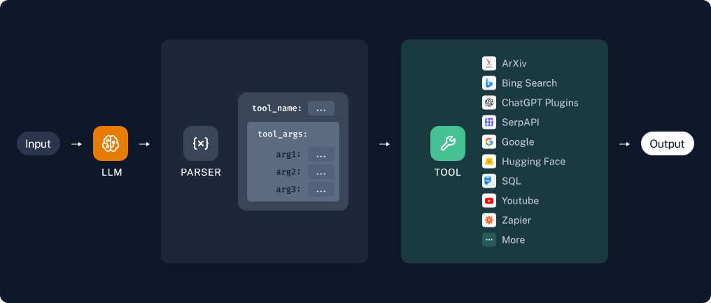
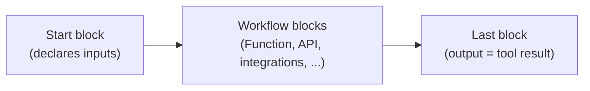

# Tools & Workflows

Tools let your assistant take real actions during a conversation: search the literature, query databases, post notifications, create tickets, call APIs, or run computations. The LLM decides when a tool is relevant, generates its input parameters, invokes it, and folds the result into its answer.



## How tool selection works

1. The user sends a message.
2. The LLM compares the message against the names and descriptions of the tools enabled in the project.
3. If a tool matches, the LLM generates the input parameters and the platform invokes it (multiple tools can run in parallel).
4. The tool output — text and/or images — is passed back to the LLM to generate the final response.

Tools are invoked automatically based on the LLM's judgment; there is no way to force invocation, but you can encourage it through prompting. Tool selection does not use the project's default chat model. It is routed through the project's own OpenAI or OpenAI-compatible provider when one is configured on the **LLMs** page, and otherwise through the Illinois-hosted default router. The Tools page shows which of these is in effect (**Custom router**, **Default router**, or **Offline** when neither is available). Users can toggle individual tools on or off per conversation from the **Tools** tab of the settings panel on the chat page.

## Building tools with Sim AI

Tools are [Sim AI](https://sim.ai) workflows. Sim is a visual workflow builder that ships with the Illinois Chat stack and shares its Keycloak login, so any workflow you build and deploy in a Sim workspace can be exposed to a chatbot as a tool. The hosted site runs Sim at [sim.chat.illinois.edu](https://sim.chat.illinois.edu/); new accounts wait for approval before they can build anything (see [Getting help](../sim-user-guide.md#getting-help) for who to contact).

The [Sim AI user guide](../sim-user-guide.md) covers signing in, approval, inviting collaborators, and which Sim blocks are available on this deployment.

!!! tip "Worked example"
    [Build a Tool in Sim: arXiv Example](build-a-sim-tool.md) walks through a complete tool, from an empty workflow to a chatbot that calls it, and explains the rules below as they come up.

A tool is a Sim workflow with three parts:



### Inputs

!!! warning "The Start block defines your tool's inputs"
    The fields you declare on the workflow's **Start** block become the tool's parameters. The LLM reads each field's name and description to decide what to pass, so describe every input and include an example value. A workflow whose inputs have no descriptions is skipped rather than published with a guessed signature.

Three rules apply to every input:

- **Every input needs a description.** It is the only thing the LLM has to go on.
- **An input is optional only if its description says so.** Sim has no "required" switch, so Illinois Chat reads the description: a phrase like *optional*, *not required* or *can be left blank* marks the input optional. The word *required* anywhere in the description makes it required, even next to *optional*.
- **The Start block's value is the default.** When the LLM omits an optional input, Sim fills in whatever you typed in the Start block's value column.

### Outputs

No explicit return statement is needed: **the output of the last block is the tool's return value.** Tools can return arbitrary JSON.

### Description

The workflow description is the single most important thing the LLM reads when deciding whether to use your tool. Set it in Sim under **Deploy → API → Edit API Info**. Say what the tool returns, what it needs, and how the inputs change the result. Workflows without a description are flagged on the Tools page with a **No description in Sim** badge and are rarely chosen.

### Images

Images are passed as an array of `image_urls` in a JSON object — URLs only, no raw binary data:

```json
{
  "image_urls": ["https://example.com/img-1.png", "https://example.com/img-2.png"],
  "other-useful-text": "These images depict the circle of life in the savanna."
}
```

- **Image input** — declare an `image_urls` input on the Start block. Illinois Chat fills it with the URLs of the images attached to the message.
- **Image output** — return a JSON object with a top-level `image_urls` key. The images render inline in the chat, and the final LLM can see them. You can mix images with any other JSON data; only `image_urls` is specially handled.

## Recommended pattern

Most tools follow the same shape: a **Start** block that declares the inputs, a **Function** block that checks and combines them, and a main block that does the work — either one of Sim's integration blocks or an **API** block calling a small HTTP endpoint you host. Putting the logic in a Function block or in code you control keeps the workflow short and stops bad inputs from reaching the service silently; the [worked example](build-a-sim-tool.md#why-the-function-block-matters) shows what goes wrong without it.

## Using tools in your project

1. In Sim, create an API key under **Settings → Sim Keys** and note the ID of the workspace that holds your workflows (it is in the workspace URL).
2. Open your project's **Tools** page in Illinois Chat (`/<your-project>/tools`), paste the API key and workspace ID, and save. The page lists every **deployed** workflow in that workspace; drafts do not appear until you deploy them.
3. Enable the tools you want active in your project.
4. Start chatting — tools are invoked as needed.

See [Connecting a Sim workspace to an Illinois Chat project](../sim-user-guide.md#connecting-a-sim-workspace-to-an-illinois-chat-project) for the details, including the optional base URL and what the tool-routing status on the Tools page means.
