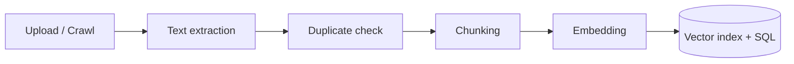
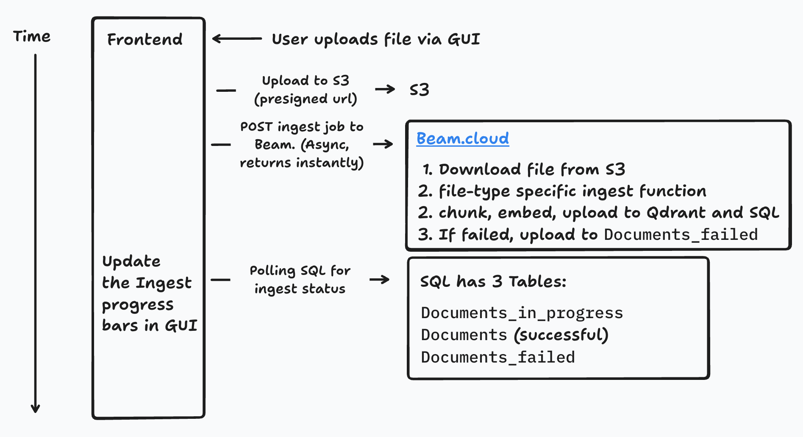

# Documents

**Documents** are the materials your assistant is grounded in: files you upload, web pages you crawl, and content imported from integrations like Canvas, PubMed, or GitHub.

## The ingest pipeline

Whenever you add a document, it flows through the same pipeline:

1. **Text extraction** — a type-specific ingest function extracts text from the file (PDF, Word, PowerPoint, HTML, video transcription with Whisper, and so on).
2. **Duplicate check** — content-based matching prevents re-ingesting identical documents (see below).
3. **Chunking** — text is split into overlapping chunks small enough for the embedding model.
4. **Embedding** — each chunk is converted into a vector using the configured embedding model.
5. **Storage** — vectors go to the vector database (Qdrant); text and metadata go to SQL and object storage.

Ingest is asynchronous and queued, so large uploads don't overwhelm the system. Failed ingests are retried automatically with exponential backoff. The Materials page shows a success or failure indicator for each document as ingestion progresses.

## Duplicate handling

There are two pathways for new documents — direct file upload and web crawl — and both share content-based deduplication, performed after text extraction:

- The database is queried by `s3_path` (uploads) or `url` (crawls).
- If nothing matches, the document is new and is ingested.
- If a document with the exact same filename or URL exists, contents are compared:
    - **Contents match** → the incoming document is a duplicate and is *not* ingested.
    - **Contents differ** → it is treated as an updated version; the old document is removed and the new one ingested.

## Document ingest: how does it work?

1. The user uploads a document via the file-upload dropzone.
    1. Client-side check for supported filetypes.
    2. A presigned S3 URL is generated for a direct client → S3 upload (bypassing the app servers to save bandwidth).
    3. After the upload completes, an ingest job is posted to the queue.
2. The ingest worker picks up the job:
    1. The filetype is detected and the request forwarded to the matching ingest function (PDF, Word, Excel, ...). Each function shares the same interface: extract text plus per-page metadata, then call `split_and_upload()`.
    2. [Duplicates are detected](documents-ingest.md#duplicate-handling) and skipped or replaced.
    3. Text is chunked, embedded, and uploaded to Qdrant and SQL. On failure, the job retries up to 9 times with exponential backoff.
3. Meanwhile, the frontend polls the database to show success/failure indicators in the UI.

### Ingest during web crawling

Crawled sources always link back to the original site, like a search engine. Compatible files (PDF, Word, PPT, Excel) are backed up to S3, but citations link to the original source, falling back to the local copy if the original 404s. HTML pages are not uploaded to S3 — their text is stored directly in SQL. See [Web Crawling](../building/dashboard/web-crawling.md).

## Under the hood

Crawling is powered by [Crawlee](https://crawlee.dev/) with Playwright, running as its own service (`apps/crawlee` in the monorepo). It is fast — crawls have been observed at 10 Gbps using six cores of parallel JavaScript — and cheap to host.

## Next steps

- [Uploading Materials](../building/dashboard/uploading-files.md) — supported formats and upload methods.
- [Retrieval](retrieval.md) — how documents are found at question time.
