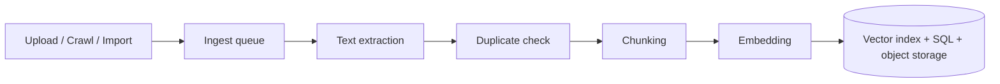

# Documents & Ingest

**Documents** are the materials a chatbot is grounded in: files you upload, web pages you crawl, and content imported from Canvas or GitHub. Whatever the source, every document goes through the same pipeline.

## The ingest pipeline

1. **Upload** — for files, the browser first checks the type (audio and video are rejected), then uploads straight to object storage through a presigned URL, bypassing the app servers. When the upload completes — or when the crawler or an import has fetched a page — an ingest job is posted to the backend's `/ingest` endpoint and queued.
2. **Text extraction** — the ingest worker picks up the job, detects the file type and hands it to the matching ingest function (PDF, Word, PowerPoint, Excel, HTML, Markdown, subtitles, images, source code, and a plain-text fallback for other formats). Each function has the same interface: extract text plus per-page metadata, then hand over for splitting.
3. **Duplicate check** — content-based matching prevents re-ingesting identical documents (see below).
4. **Chunking** — text is split into overlapping chunks small enough for the embedding model.
5. **Embedding** — each chunk is converted into a vector using the deployment's embedding model (see the [Configuration reference](../self-hosting/configuration.md)).
6. **Storage** — vectors go to the vector store, text and metadata to SQL, and the original file stays in object storage.

Ingest is asynchronous and queued, so large uploads do not overwhelm the system. A job that fails is re-queued immediately and retried up to `MAX_JOB_RETRIES` times (10 by default); meanwhile the Project Files table on the Dashboard polls for each document's success or failure.

## Where vectors live

The default vector store is **pgvector**, inside the same PostgreSQL database as the metadata. A chatbot can instead be pointed at its own Qdrant collection or an external database through an [external connection](../building/external-connections.md).

## Duplicate handling

Both pathways — direct file upload and web crawl — share content-based deduplication, performed after text extraction:

- The database is queried by `s3_path` (uploads) or `url` (crawls).
- If nothing matches, the document is new and is ingested.
- If a document with the exact same filename or URL exists, contents are compared:
    - **Contents match** → the incoming document is a duplicate and is *not* ingested.
    - **Contents differ** → it is treated as an updated version; the old document is removed and the new one ingested.

## Web crawling

Crawling is powered by [Crawlee](https://crawlee.dev/) with Playwright, running as its own service (`apps/crawlee` in the repository). Crawled sources always link back to the original site, like a search engine:

- **HTML pages** are not uploaded to object storage — their text is stored directly in SQL, with the source URL preserved for citations.
- **Compatible files** found during the crawl (PDF, Word, PowerPoint, Excel) are backed up to object storage, but citations link to the original source, falling back to the local copy if the original 404s.

How to start a crawl and choose its scope: [Web crawling](../building/dashboard/web-crawling.md).

## Next steps

- [Uploading files](../building/dashboard/uploading-files.md) — supported formats and upload methods.
- [Document groups & deleting](../building/dashboard/document-groups.md) — organising and removing documents.
- [Retrieval](retrieval.md) — how documents are found at question time.
