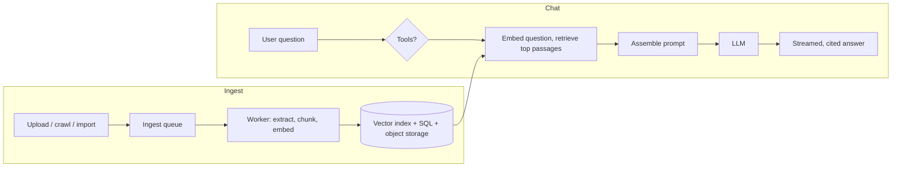

# How It Works

Illinois Chat uses **retrieval-augmented generation (RAG)**: instead of relying on what a language model memorised, every answer is built from passages retrieved from the documents a chatbot's builder added.

## Two pipelines

1. **Ingest** — when a builder adds a document, the frontend (or the crawler) posts a job to the backend's `/ingest` endpoint, which queues it. A worker extracts the text, checks for duplicates, splits it into overlapping chunks, converts each chunk into an embedding and stores vectors, text and metadata. Details: [Documents & ingest](documents-ingest.md).
2. **Chat** — when a user asks a question, the question is embedded, matched against the chatbot's index, and the best passages are handed to a large language model together with the conversation, which answers with citations. Details: [Retrieval](retrieval.md).

Each chatbot's index is isolated; retrieval never crosses chatbot boundaries.

## What happens when you hit send

1. The question is sent to the frontend.
2. If the chatbot has tools, a routing model decides whether any apply and runs them; the outputs are kept for the prompt. Which model does this is described in [Tool routing](tool-routing.md).
3. The question (optimised by Smart Document Search when enabled) is embedded with the deployment's embedding model and the most relevant chunks are retrieved from the vector index, limited to the document groups the user has switched on.
4. The prompt is assembled: as many retrieved passages as fit in the context window, as much conversation history as possible, tool outputs and images, plus the behaviour switches from the [Prompting](../building/prompting.md) page (Guided Learning, document-based references only, and so on).
5. The prompt goes to the model the user selected and the answer streams back. While it streams, a state machine turns the model's citation markers (such as `[doc 1, page 3]`) into links to the right document and page.

## Read on

- [Documents & ingest](documents-ingest.md) — formats, duplicate handling, retries, where things are stored.
- [Retrieval](retrieval.md) — how passages are found, and ideas that are not in the product.
- [Tool routing](tool-routing.md) — which model picks tools and how operators enable the default router.
- [Glossary](glossary.md) — the terms used across these docs.
