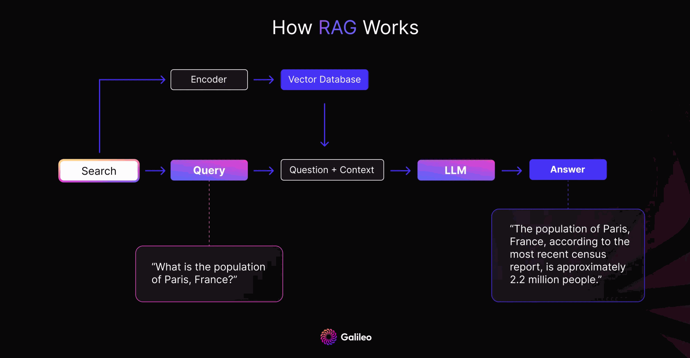

# Retrieval

In retrieval-augmented generation (RAG), the quality of an answer depends on actually retrieving the context needed to answer the question — finding the "needle in the haystack" of relevant documents.

## Vector retrieval

The user's query is embedded with the deployment's embedding model and compared against the embeddings of all document chunks in the chatbot, restricted to the document groups the user has switched on. The top matches (up to 100 chunks) are included in the final LLM call.

Two switches on the [Prompting](../building/prompting.md) page change what reaches this step: **Smart Document Search** rewrites the question into a better search query first, and **Document-Based References Only** tells the model to answer from the retrieved passages alone.

Programmatic access to retrieval (without answer generation) is available via the [Retrieval API](../api/retrieval.md) and the `retrieval_only` flag of the [Chat API](../api/chat.md).

## Research ideas (not in the product)

The methods below were explored during development and are described here for context. None of them is available in Illinois Chat today; the multi-query switch in the interface is disabled and its API endpoint returns an error.

### 2. Parent document retrieval

*Parent document retrieval* expands the context around retrieved chunks: for each of the top 5 chunks, the 2 preceding and 2 following chunks are also retrieved.

This solves the "off by one" problem. For example, a query like *"What is the solution to the Bernoulli equation?"* may match a textbook's *problem setup* but not the *solution* that follows in subsequent paragraphs. Expanding the context captures both. This works particularly well for textbook-style questions.

### 3. Multi-query retrieval with filtering

**Key idea:** use an LLM to diversify the query, then use a small LLM to filter out irrelevant passages before the (much more expensive) final answer generation.

The retrieval data flow:

1. User query →
2. an LLM generates multiple similar queries with more keywords →
3. vector retrieval and reranking →
4. a small LLM filters out irrelevant passages →
5. parent documents are fetched for the top 5 passages →
6. the final passage set goes to the large LLM for answer generation.

The trade-off is latency: LLM filtering adds seconds even when fully parallelized, in exchange for higher precision.

### 4. LLM-guided retrieval

**Key idea:** retrieval as tool use. Mirroring how a human researches, the LLM decides whether the retrieved context is relevant and — more importantly — *where to look next*, choosing between actions like "next page", "previous page", or "jump to section" to explore documents and find the best passages.

LLM-guided retrieval thrives on structured documents. For scientific PDFs, a parsing pipeline such as [Grobid](https://github.com/kermitt2/grobid) for sections and references, [Unstructured](https://github.com/Unstructured-IO/unstructured) for tables and [Nougat](https://github.com/facebookresearch/nougat) for mathematics would be a prerequisite; Illinois Chat uses none of these.
