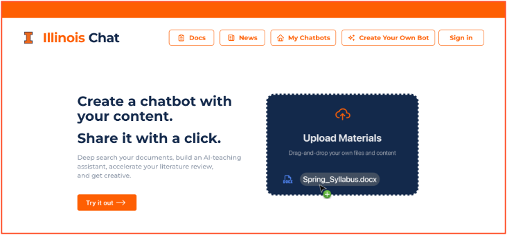

# Illinois Chat

**Illinois Chat is a self-hostable AI chat platform for building course, research, and organization-specific chatbots over curated documents and web content.**

Upload your documents (or use the built-in web crawler), then chat with them. Ask questions, use it like search, have it review your grant proposals, and more. It excels at Q&A over an unlimited number of documents — some chatbots contain millions.

The campus-supported instance is available at [chat.illinois.edu](https://chat.illinois.edu), and the entire platform is [open source on GitHub](https://github.com/Center-for-AI-Innovation/Illinois-Chat) under the Apache License 2.0, so you can also [run it yourself](self-hosting/index.md).

## Why Illinois Chat?

- **Control over your information sources.** Unlike vendor-driven chat sites, your data is never used to train models. You decide exactly which documents your chatbot knows about.
- **Source citations.** Answers cite their sources, so users can click through to the original documents you uploaded or crawled.
- **Robust platform features.** Authentication, sharing and access control, analytics, and support for many different language models.
- **User analytics.** When you share your chatbot as a learning tool, Illinois Chat provides analytics on how users interact with it, helping you tailor your content.

## Top use cases

1. **AI teaching assistant** — create a chatbot for your courses that provides expert answers, cites sources, and encourages students to explore primary documents. It even [integrates with Canvas](building/dashboard/importing.md).
2. **Literature review** — upload academic PDFs or research papers and let the chatbot help you find relevant information and citations.
3. **Project onboarding companion** — integrate resources like GitHub repos and PDFs to efficiently onboard team members.
4. **Advanced search tool** — use Illinois Chat over your curated content for fast, reliable information retrieval.

## Where to start

- :material-chat: **[Use a chatbot](getting-started/using-a-chatbot.md)** — someone shared a chatbot with you: picking a model, settings, sources and citations, exporting your history.
- :material-hammer-wrench: **[Build a chatbot](building/index.md)** — create one, upload or crawl content, choose LLMs, write the prompt, add tools, share it, and read the analytics. New here? Take the [Quickstart](getting-started/quickstart.md).
- :material-api: **[Integrate](api/index.md)** — call a chatbot from your own application through the chat, retrieval, ingest and export APIs.
- :material-server: **[Run it yourself](self-hosting/index.md)** — the full Docker Compose stack, configuration reference, upgrades and troubleshooting.
- :material-source-branch: **[Contribute](contributing/dev-setup.md)** — development setup, repository layout, tests and CI, writing these docs.

Curious what happens between a question and an answer? See [How It Works](how-it-works/index.md). Release notes and announcements are on the [Blog](blog/index.md).

## Acknowledgements

Illinois Chat is developed by the [Center for AI Innovation (CAII)](https://ai.ncsa.illinois.edu/) at the National Center for Supercomputing Applications (NCSA), University of Illinois Urbana-Champaign, with support from the Office of the CIO, the Healthcare Innovation Program Office at NCSA, and the Gies College of Business, among others.
