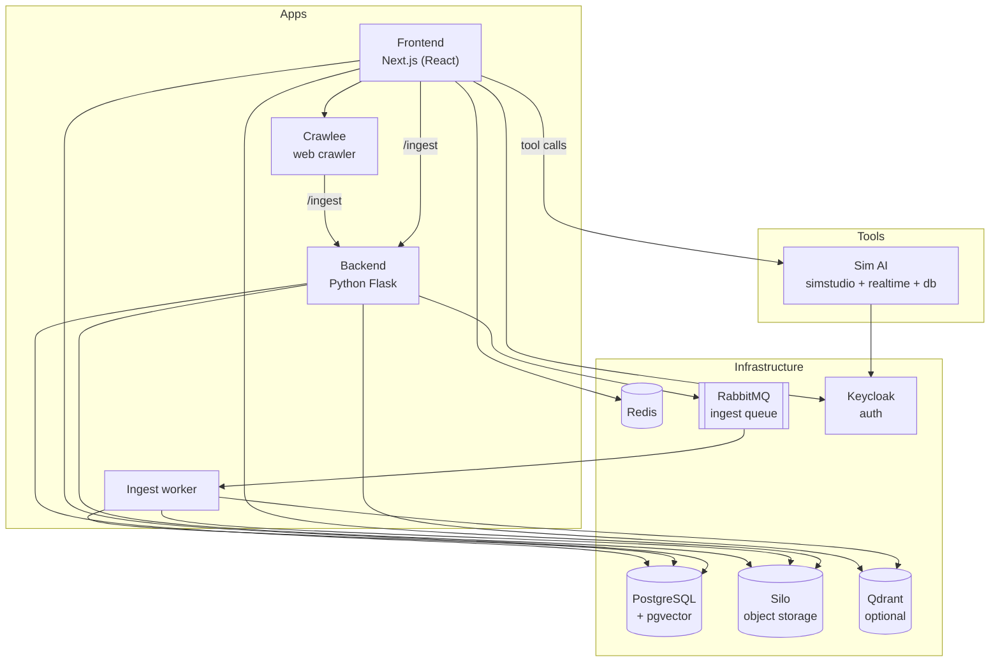

# Services, ports & architecture

Everything runs in Docker. Two Compose files make up the full stack — `infra/docker/docker-compose.yaml` for the application and `infra/docker/docker-compose.sim.yaml` for the Sim AI tools platform — and `docker-compose.dev.yaml` runs only the infrastructure for [local development](../contributing/dev-setup.md). What happens inside a chat or an ingest is on [How It Works](../how-it-works/index.md).

## The stack

**Frontend: React + Next.js** — the full-stack web application; most API routes, including the public [Chat API](../api/index.md), live here.

**Backend: Python Flask** — retrieval for Qdrant-backed chatbots (`/getTopContexts`; pgvector retrieval runs in the frontend), the ingest entry point (`/ingest`, which queues a job), exports and Nomic maps. It listens on port 8001 inside the Compose network and is not published to the host.

**Ingest worker** — consumes the RabbitMQ queue, extracts text, embeds and stores it.

**Crawlee** — the web crawler; posts every page it fetches to the backend's `/ingest`.

**Sim AI** — the tools platform: `simstudio` (the app), `sim-realtime` and `sim-db`, plus four one-shot setup jobs. Chatbots call deployed Sim workflows as tools. Details in [Tools Platform (Sim AI)](sim.md).

**Databases:**

- **PostgreSQL (pgvector)** — chatbots, documents, conversations and, by default, the document embeddings.
- **Silo** — MinIO-compatible object storage for uploaded files (Compose service `minio`).
- **Redis** — chatbot metadata and per-chatbot LLM settings, read on every page load.
- **Qdrant** — optional vector store, used only by chatbots whose [external connection](external-connections.md) points at it.

**Required stateless services:**

- **RabbitMQ** — absorbs spiky ingest workloads; jobs are processed by the worker.
- **Keycloak** — user authentication for the app and for Sim (user data in its own Postgres).

**Optional add-ons:** Ollama (`docker-compose.models.yaml`) for local inference; Nomic Atlas, Sentry and PostHog through their API keys.

## Ports

Host ports as published by each Compose file. Those marked *variable* can be changed in `.env` (see the [Configuration reference](configuration.md)).

| Service | Full stack | Dev stack | Sim overlay |
| --- | --- | --- | --- |
| `frontend` | `FRONTEND_PORT` (3000) | app on host: 3000 | |
| `backend` | internal only (8001) | app on host: 8000 | |
| `crawlee` | `CRAWLEE_PORT` (3345) | app on host: 3345 | |
| `postgres-illinois-chat` | `POSTGRES_PORT` (5432) | 5432 | |
| `postgres-keycloak` | `KEYCLOAK_DB_PORT` (5433) | 5433 | |
| `keycloak` | 8080 | 8080 | |
| `minio` (Silo) API / console | 9000 / 9001 | `PUBLIC_MINIO_API_PORT` (10000) / `PUBLIC_MINIO_DASHBOARD_PORT` (9001) | |
| `qdrant` HTTP / gRPC | 6333 / 6334 | 6333 / 6334 | |
| `redis` | internal only (6379) | 6379 | |
| `rabbitmq` AMQP / management | internal only (5672 / 15672) | 5672 / 15672 | |
| `drizzle-gateway` | | 4983 | |
| `simstudio` | | | `SIM_APP_PORT` (3010) |
| `sim-realtime` | | | `SIM_REALTIME_PORT` (3011) |
| `sim-db` | | | `SIM_POSTGRES_PORT` (55432) |
| `ollama` (models overlay) | 11434 | 11434 | |

Internal only on the full stack: `backend`, `worker`, `redis`, `rabbitmq`, `minio-init`. Use the object-storage **API** port for uploads and presigned URLs, never the console port.

## Where the code lives

The repository tree is described on [Repository layout](../contributing/repository-layout.md).
