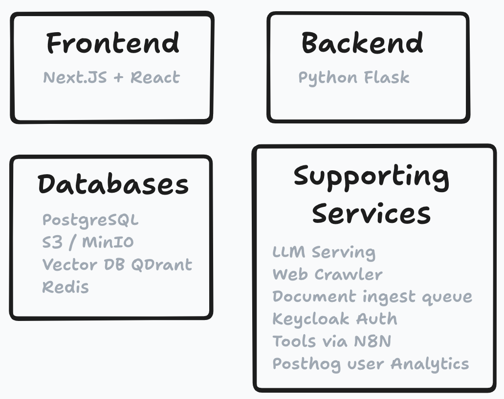
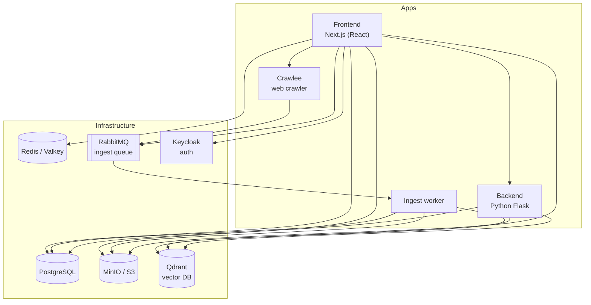

# System Architecture

The key priority of this architecture is developer velocity. Everything runs in Docker.

## The stack

**Frontend: React + Next.js** — the full-stack web application; most backend operations live in Next.js API routes.

**Backend: Python Flask** — used for Python-specific features such as advanced retrieval methods and Nomic document maps, plus the ingest worker.

**Databases:**

- **PostgreSQL** — main "top-level" storage; contains pointers to all other databases plus metadata.
- **MinIO / S3** — object storage for files (PDF, DOCX, MP4, ...).
- **Qdrant** — vector database for document embeddings.
- **Redis / Valkey** — user and project metadata; fast retrieval needed on every page load.

**Required stateless services:**

- **RabbitMQ ingest queue** — absorbs spiky ingest workloads without overwhelming the databases; jobs are processed by the ingest worker.
- **Keycloak** — user authentication (user data stored in Postgres).

**Optional add-ons:**

- **Ollama / vLLM** — local LLM serving.
- **Crawlee** — web crawling.
- **Nomic Atlas** — semantic maps of documents and conversation history.
- **Sim AI** — user-defined tool workflows.
- **Sentry** — error monitoring; **PostHog** — product analytics.

## Where the code lives

| Path | Contents |
| --- | --- |
| `apps/frontend` | Next.js web application |
| `apps/backend` | Flask API and ingest worker |
| `apps/crawlee` | Crawlee web-crawling service |
| `infra/docker` | Docker Compose files |
| `infra/db` | Postgres schema and migrations |
| `infra/keycloak` | Keycloak realm and theme |
